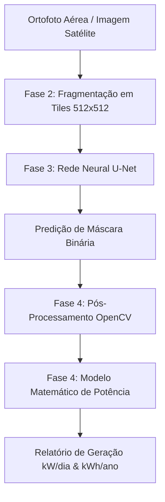

# Estimativa de Potência Fotovoltaica via Segmentação Semântica U-Net (TCC II)

Este repositório contém a implementação prática do Trabalho de Conclusão de Curso (TCC II), focado na detecção automatizada de painéis solares em imagens aéreas de alta resolução e na estimativa da capacidade de geração de energia fotovoltaica.

O sistema utiliza a arquitetura de rede neural profunda **U-Net** combinada com técnicas de pós-processamento digital de imagens (**OpenCV**) e modelagem matemática fotovoltaica.

---

## 💻 Visão Geral do Sistema

O pipeline de processamento é dividido em duas formas de interação: por scripts sequenciais (CLI) e por um painel web interativo (Dashboard FastAPI).



---

## 📂 Estrutura do Repositório

```text
├── data/                       # Diretório de dados (Imagens brutas e processadas)
│   ├── raw/                    # Ortofotos originais (.jp2, .jpeg)
│   └── processed/              # Tiles segmentados para treino, validação e teste
├── models/                     # Pesos salvos do modelo de rede neural
│   └── unet_solar.pth          # Pesos do modelo treinado da U-Net
├── src/                        # Scripts de código-fonte
│   ├── static/                 # Frontend da interface web (HTML, CSS, JS)
│   │   ├── index.html          # Painel e layout principal
│   │   ├── style.css           # Tema escuro e estilo premium
│   │   └── app.js              # Controlador Javascript
│   ├── 1_data_acquisition.py   # Aquisição e georreferenciamento de imagens
│   ├── 2_fragmentation.py      # Divisão da imagem aérea em blocos (tiles) urbanos
│   ├── 3_train_unet.py         # Treinamento supervisionado da U-Net
│   ├── 4_inference_estimation.py # Inferência nos testes e cálculo de erros
│   ├── 5_visualize_preds.py    # Geração de visualizações e overlays comparativos
│   ├── 6_generate_pseudo_labels.py # Geração automatizada de rótulos auxiliares
│   ├── label_tool.py           # Ferramenta para rotulação manual simples
│   └── web_interface.py        # Backend FastAPI e servidor da interface
├── requirements.txt            # Dependências Python do projeto
└── README.md                   # Instruções de uso (Este arquivo)
```

---

## ⚙️ Pré-requisitos e Instalação

### Instalação de Dependências

O projeto utiliza bibliotecas científicas e de visão computacional. Instale-as diretamente via terminal:

```bash
pip install -r requirements.txt
```

> [!NOTE]
> Para utilizar aceleração por hardware (GPU) no treinamento e inferência, garanta que a versão do PyTorch instalada esteja configurada para o suporte a CUDA de sua GPU.

---

## 🚀 Como Utilizar o Sistema

### 1. Preparação e Fragmentação (Fase 2)
Para recortar imagens aéreas grandes em blocos menores de 512x512 pixels focados em áreas urbanas (descartando áreas de pastagem uniforme), execute:

```bash
python src/2_fragmentation.py
```

### 2. Treinamento da U-Net (Fase 3)
Com as imagens e suas respectivas máscaras anotadas disponíveis, execute o treinamento da rede neural profunda:

```bash
python src/3_train_unet.py
```
*O treinamento rodará por 50 épocas por padrão, salvando o arquivo de pesos ideal em `models/unet_solar.pth`.*

### 3. Inferência e Avaliação de Erros (Fase 4)
Para aplicar o modelo no conjunto de teste e obter o relatório estatístico da estimativa de potência:

```bash
python src/4_inference_estimation.py
```

---

## 🖥️ Painel Web Interativo (FastAPI)

Para simplificar a visualização do pipeline e possibilitar o upload dinâmico de qualquer imagem aérea, criamos uma interface moderna em tema escuro.

### Como Executar a Interface Web:

1. No terminal, execute o servidor FastAPI:
   ```bash
   python src/web_interface.py
   ```
2. Abra seu navegador de preferência e digite o endereço local:
   👉 **[http://127.0.0.1:8000](http://127.0.0.1:8000)**

### Funcionalidades do Dashboard:
* **Upload Interativo**: Drag and drop simples de imagens.
* **Ajuste de Parâmetros na Tela**:
  - **GSD (m/pixel)**: Resolução do pixel no solo. Ex: `0.0389` para ortofotos de alta precisão (3.89 cm) ou `0.2986` para Zoom 19 do Bing (29.8 cm).
  - **Eficiência ($\eta$)**: Eficiência média comercial do painel solar (ex: `18.5%`).
  - **Irradiação local ($I_{local}$)**: Irradiação solar diária média da região (ex: `5.4 kWh/m²/dia` para Dourados-MS).
  - **Threshold e Filtro**: Ajuste dinâmico de limiar de confiança do modelo e tamanho mínimo de área para limpeza de ruídos.
* **Timeline de Pipeline**: Acompanhamento visual animado de cada estágio do pipeline em execução.
* **KPIs Dinâmicos**: Exibição da Área estimada ($m^2$), Potência estimada ($kW$), Geração anual ($kWh$) e total de grupos detectados.
* **Comparador e Visualizador de Imagens**: Alternação rápida de abas entre Imagem Original, Máscara da U-Net e Overlay (imagem original com realce translúcido sobre as placas solares).
* **Galeria de Tiles**: Lista os blocos de 512x512 onde o modelo encontrou placas solares, revelando a segmentação com efeito hover.

---

## 📐 Modelo Matemático Adotado

Para garantir o rigor físico e acadêmico no TCC, a modelagem foi estruturada distinguindo a **Potência Instalada (Pico)** da **Geração de Energia Real** (considerando perdas do sistema):

### 1. Potência de Pico Instalada ($P_{pico}$)
Representa a capacidade máxima nominal instalada sob Condições Padrão de Teste (STC, irradiação de $1 \text{ kW/m²}$):

$$P_{pico} (kWp) = A_{total} \times \eta$$

### 2. Geração Diária de Energia ($E_{diaria}$)
Calcula a geração real média diária de energia em $kWh$, introduzindo a **Taxa de Desempenho ($PR$ - Performance Ratio)** para computar perdas reais (temperatura, cabeamento, sujeira e eficiência do inversor):

$$E_{diaria} (kWh/dia) = P_{pico} \times I_{local} \times PR$$

### 3. Geração Anual de Energia ($E_{anual}$)
Estima a geração acumulada ao longo de um ano comercial:

$$E_{anual} (kWh/ano) = E_{diaria} \times 365$$

Onde:
* $A_{total} = \text{Pixels de Painel} \times \text{GSD}^2$ (Área em $m^2$).
* $\eta$: Eficiência média nominal dos módulos fotovoltaicos (padrão: $18.5\%$).
* $I_{local}$: Média de irradiação diária da localidade (padrão: $5.4 \text{ kWh/m²/dia}$ para Dourados-MS).
* $PR$: Performance Ratio (Perdas acumuladas). Padrão de literatura e mercado de $75\%$ ($0.75$).
