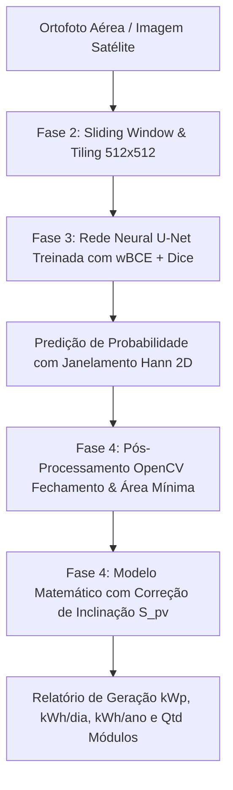

# Estimativa de Potência Fotovoltaica via Segmentação Semântica U-Net (TCC II)

Este repositório contém a implementação prática do Trabalho de Conclusão de Curso (TCC II), focado na detecção automatizada de painéis solares em imagens aéreas e ortofotos de alta resolução, aplicando correção geométrica de inclinação de telhado e estimativa da capacidade de geração de energia fotovoltaica.

O sistema utiliza a arquitetura de rede neural profunda **U-Net** com **Perda Composta ($\text{wBCE} + \text{Dice Loss}$)**, **Sliding Window com janelamento 2D suave (Hann)** para mitigação de efeitos de borda, pós-processamento digital de imagens (**OpenCV**) e modelagem físico-matemática fotovoltaica com correção angular.

---

## 💻 Visão Geral do Sistema

O pipeline de processamento é dividido em duas formas de interação: por scripts sequenciais (CLI) e por um painel web interativo (Dashboard FastAPI).



---

## 📂 Estrutura do Repositório

```text
├── data/                       # Diretório de dados (Imagens brutas e processadas)
│   ├── raw/                    # Ortofotos originais (.jp2, .jpeg) e World Files (.jgw)
│   └── processed/              # Tiles segmentados para treino, validação e teste
├── models/                     # Pesos salvos do modelo de rede neural
│   ├── unet_solar.pth          # Pesos do modelo treinado da U-Net
│   └── unet_solar_best.pth     # Checkpoint com o melhor score Dice/F1
├── src/                        # Scripts de código-fonte
│   ├── static/                 # Frontend da interface web (HTML, CSS, JS)
│   │   ├── index.html          # Painel e layout principal com controles de inclinação
│   │   ├── style.css           # Tema escuro, glassmorphism e estilo premium
│   │   └── app.js              # Controlador Javascript assíncrono
│   ├── 1_data_acquisition.py   # Aquisição e georreferenciamento de imagens
│   ├── 2_fragmentation.py      # Fragmentação sistemática com grade sobreposta (stride)
│   ├── 3_train_unet.py         # Treinamento supervisionado da U-Net (wBCE + Dice Loss)
│   ├── 4_inference_estimation.py # Inferência Sliding Window, correção angular e métricas
│   ├── 5_visualize_preds.py    # Geração de visualizações e overlays comparativos
│   ├── 6_generate_pseudo_labels.py # Geração automatizada de rótulos auxiliares
│   ├── label_tool.py           # Ferramenta interativa de rotulação manual
│   └── web_interface.py        # Backend FastAPI e servidor da interface
├── requirements.txt            # Dependências Python do projeto
├── contexto.md                 # Fundamentação técnica e científica do TCC II
└── README.md                   # Instruções de uso (Este arquivo)
```

---

## ⚙️ Pré-requisitos e Instalação

### Instalação de Dependências

O projeto utiliza bibliotecas científicas e de visão computacional. Instale-as diretamente via terminal:

```bash
pip install -r requirements.txt
```

> [!NOTE]
> Para utilizar aceleração por hardware (GPU) no treinamento e inferência, garanta que a versão do PyTorch instalada esteja configurada para o suporte a CUDA de sua GPU.

---

## 🚀 Como Utilizar o Sistema

### 1. Preparação e Fragmentação Sistemática (Fase 2)
Para recortar imagens aéreas grandes em blocos de 512x512 pixels com sobreposição para mitigar o corte de painéis nas bordas:

```bash
python src/2_fragmentation.py
```

### 2. Treinamento da U-Net com Perda Composta (Fase 3)
Treine a rede neural profunda utilizando a perda composta $\text{wBCE} + \text{Dice Loss}$, que equilibra o desbalanceamento severo de classes:

```bash
python src/3_train_unet.py
```
*O treinamento salva o modelo final em `models/unet_solar.pth` e o melhor checkpoint em `models/unet_solar_best.pth`.*

### 3. Inferência e Avaliação de Erros com Correção Geométrica (Fase 4)
Para aplicar o modelo no conjunto de teste via *Sliding Window* com janelamento Hann 2D e obter o relatório estatístico da estimativa de potência:

```bash
python src/4_inference_estimation.py
```

---

## 🖥️ Painel Web Interativo (FastAPI)

Para simplificar a visualização do pipeline e possibilitar o upload dinâmico de qualquer imagem aérea, criamos uma interface moderna em tema escuro.

### Como Executar a Interface Web:

1. No terminal, execute o servidor FastAPI:
   ```bash
   python src/web_interface.py
   ```
2. Abra seu navegador de preferência e digite o endereço local:
   👉 **[http://127.0.0.1:8000](http://127.0.0.1:8000)**

### Funcionalidades do Dashboard:
* **Upload Interativo**: Drag and drop simples de ortofotos e imagens aéreas.
* **Ajuste de Parâmetros na Tela**:
  - **GSD (m/pixel)**: Resolução do pixel no solo (ex: `0.0389` para ortofotos de 3.89 cm ou `0.2986` para Zoom 19 do Bing).
  - **Inclinação do Telhado ($\beta$)**: Ângulo de inclinação dos módulos (ex: `20°` para telhados residenciais, `22°` para latitude local).
  - **Latitude Local ($\varphi$)**: Coordenada geográfica para modelos solares (ex: `-22.22°` para Dourados-MS).
  - **Correção Geométrica ($S_{pv}$)**: Toggle para aplicar $S_{pv} = A_{proj} / \cos(\beta)$.
  - **Eficiência ($\eta$)**: Eficiência nominal média comercial (ex: `18.5%`).
  - **Irradiação local ($I_{local}$)**: Irradiação solar diária média (ex: `5.4 kWh/m²/dia`).
  - **Performance Ratio ($PR$)**: Perdas do sistema (padrão: `75%`).
  - **Threshold e Filtro**: Ajuste de limiar de confiança da U-Net e tamanho mínimo de área para limpeza de ruídos (OpenCV).
  - **Sliding Window com Hann 2D**: Inferência com sobreposição e fusão suave sem artefatos de borda.
* **Timeline de Pipeline**: Acompanhamento visual de cada estágio do pipeline em execução.
* **KPIs Dinâmicos**: Exibição da Área Real Corrigida ($S_{pv}$), Área Projetada ($A_{proj}$), Potência Pico ($kWp$), Geração Anual ($kWh/ano$), Quantidade Estimada de Módulos (~550W) e Grupos Detectados.
* **Comparador e Visualizador de Imagens**: Alternação rápida de abas entre Sobreposição Solar (Overlay Dourado), Máscara da U-Net e Imagem Original.
* **Galeria de Tiles**: Lista os blocos de 512x512 onde o modelo encontrou placas solares, revelando a segmentação com efeito hover.

---

## 📐 Modelo Matemático Adotado

Para garantir o rigor físico e acadêmico no TCC, a modelagem foi estruturada distinguindo a **Área Projetada Ortogonal ($A_{proj}$)** da **Área Real Inclinada ($S_{pv}$)**, da **Potência Instalada (Pico)** e da **Geração Real de Energia**:

### 1. Área Projetada Ortogonal ($A_{proj}$)
Calcula a projeção horizontal plana capturada pelo sensor da câmera aérea:

$$A_{proj} (m^2) = \text{Pixels de Painel} \times \text{GSD}^2$$

### 2. Correção Geométrica de Inclinação ($S_{pv}$)
Como os módulos fotovoltaicos são instalados em telhados inclinados com ângulo $\beta$, a área real de captação de silício é maior que a projeção vista do satélite:

$$S_{pv} (m^2) = \frac{A_{proj}}{\cos(\beta)}$$

*(Para um telhado residencial com inclinação padrão de $20^\circ$, a área real é aproximadamente $+6,4\%$ maior; para $25^\circ$, $+10,3\%$ maior).*

### 3. Potência de Pico Instalada ($P_{pico}$)
Representa a capacidade nominal máxima instalada sob Condições Padrão de Teste (STC, irradiação de $1 \text{ kW/m²}$):

$$P_{pico} (kWp) = S_{pv} \times \eta$$

### 4. Geração Diária de Energia ($E_{diaria}$)
Calcula a geração média diária em $kWh$, computando perdas reais do sistema (sujeira, cabos, inversores, temperatura) pelo **Performance Ratio ($PR$)**:

$$E_{diaria} (kWh/dia) = P_{pico} \times I_{local} \times PR$$

### 5. Geração Anual de Energia ($E_{anual}$)
Estima a geração acumulada ao longo de um ano:

$$E_{anual} (kWh/ano) = E_{diaria} \times 365$$

### 6. Estimativa de Módulos Discretos ($N_{mod}$)
Estima o número físico de painéis comerciais padrão instalados (ex: módulos de $550\text{ Wp}$ com área unitária de $2,30\text{ m}^2$ e fator de preenchimento de $90\%$):

$$N_{mod} = \text{round}\left(\frac{S_{pv} \times 0,90}{2,30}\right)$$

---

## 🗺️ Integração Direta com QGIS (Processamento SIG)

O projeto inclui um algoritmo nativo para a **Caixa de Ferramentas de Processamento do QGIS** (`src/qgis_processing_script.py`), permitindo analisar grandes ortofotos municipais (ex: Dourados-MS, Maracaju-MS) diretamente no software SIG:

### Como Instalar no QGIS:
1. Abra o QGIS (versões 3.x ou 4.x).
2. Na **Caixa de Ferramentas de Processamento**, clique no ícone do Python $\rightarrow$ **Criar Novo Script a partir do Modelo...** (ou navegue até a pasta de scripts do seu perfil do QGIS).
3. Copie o arquivo `src/qgis_processing_script.py` para a pasta de scripts:
   - **Windows:** `%APPDATA%\QGIS\QGIS3\profiles\default\processing\scripts\` (ou `QGIS4`)
   - **Linux:** `~/.local/share/QGIS/QGIS3/profiles/default/processing/scripts/`
   - **macOS:** `~/Library/Application Support/QGIS/QGIS3/profiles/default/processing/scripts/`
4. Na Caixa de Ferramentas, o grupo **SolarSegment** $\rightarrow$ **Detecção de Painéis Solares (U-Net)** estará disponível.
5. Selecione a ortofoto, use a **Extensão da tela do mapa** para analisar áreas de interesse rapidamente, e o algoritmo gerará uma camada vetorial (Shapefile) com polígonos e todos os atributos fotovoltaicos calculados ($A_{proj}$, $S_{pv}$, $P_{pico}$, $E_{anual}$, $N_{mod}$).

---

## 💻 Guia Rápido: Como Rodar em Qualquer Máquina

```bash
# 1. Clonar o repositório
git clone https://github.com/VitorSouzaDeveloper/Implementa--o.git
cd Implementa--o

# 2. Criar e ativar ambiente virtual
python -m venv venv

# Windows (PowerShell):
.\venv\Scripts\Activate.ps1
# Linux / macOS:
source venv/bin/activate

# 3. Instalar dependências
pip install -r requirements.txt

# 4. Executar a Interface Web (Dashboard)
python src/web_interface.py
# Acesse: http://localhost:8000
```

