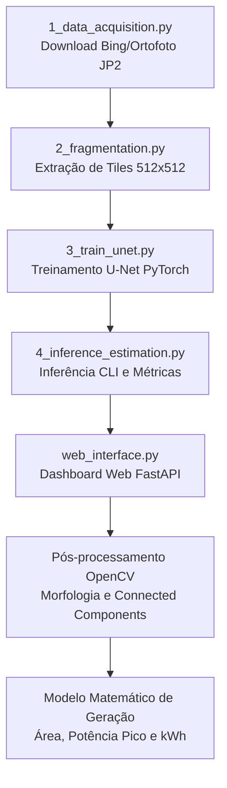

# Contexto e Plano de Evolução Técnica: SolarSegment (TCC II)

Este documento apresenta a análise completa do repositório **SolarSegment**, a validação técnica das melhorias propostas para o pipeline de visão computacional e estimativa fotovoltaica, e o direcionamento prático para aplicação no código e fundamentação no texto acadêmico do Trabalho de Conclusão de Curso (TCC II).

---

## 1. Diagnóstico do Estado Atual do Projeto

O projeto **SolarSegment** implementa um pipeline funcional ponta a ponta dividido nas seguintes etapas:

### Principais Componentes Existentes:
1. **Aquisição e Georreferenciamento (`1_data_acquisition.py`)**: Download de tiles do Bing Maps (Zoom 19) e geração de World File (`.jgw`) para cálculo do GSD (~0.2986 m/px) ou leitura de ortofoto municipal de alta precisão (`.jp2`, GSD ~0.0389 m/px).
2. **Fragmentação (`2_fragmentation.py`)**: Extração aleatória de blocos de 512x512 pixels baseada em limiar de variância/desvio padrão (`std > 35`) para focar em áreas urbanas.
3. **Treinamento da U-Net (`3_train_unet.py`)**: Arquitetura clássica U-Net com 4 níveis de downsampling/upsampling, canais escalonados (16 a 256), `BCEWithLogitsLoss()` e otimizador Adam.
4. **Inferência e Estimativa (`4_inference_estimation.py`)**: Avaliação no conjunto de teste, limiarização probabilística (threshold 0.55), fechamento morfológico (`cv2.morphologyEx`), filtragem por área mínima com `cv2.connectedComponentsWithStats` e cálculo de $P_{pico}$, $E_{diaria}$ e $E_{anual}$.
5. **Dashboard Web Interativo (`web_interface.py`, `src/static/`)**: Aplicação FastAPI com upload de imagens aéreas, controle dinâmico de parâmetros (GSD, $\eta$, $I_{local}$, $PR$, threshold, min_area, overlap), rastreamento visual de progresso, galeria de tiles e visualizador com overlays translúcidos.

---

## 2. Análise Crítica das Alterações Sugeridas

Abaixo é apresentada a avaliação minuciosa das três melhorias propostas pelo usuário, demonstrando por que **todas fazem sentido teórico, prático e acadêmico**, além de apresentar melhorias complementares.

---

### A. Mitigação do "Efeito de Borda" na Fragmentação
* **Arquivos Alvo:** `src/2_fragmentation.py`, `src/4_inference_estimation.py`, `src/web_interface.py`
* **Veredito:** **FAZ TOTAL SENTIDO (ALTAMENTE RECOMENDADO).**

#### Fundamentação Teórica e Prática:
* **Problema Físico:** Camadas convolucionais aplicam preenchimento (*zero-padding*) nas bordas dos blocos de 512x512. Consequentemente, o campo receptivo efetivo diminui drasticamente nas extremidades do tile. Quando um telhado solar é seccionado pela borda física do corte sem sobreposição, o modelo visualiza apenas metade da placa sem o contexto do telhado, gerando falsos negativos ou predições fragmentadas.
* **Solução:** 
  1. Utilizar **Janela Deslizante com Sobreposição (*Sliding Window with Overlap*)** de 20% a 50% (stride de 256 a 400 pixels para tiles de 512).
  2. Implementar **Ponderação Espacial Suave (*Smooth Blending / Hann-Gaussian Window*)**: Em vez de fazer uma média aritmética plana das probabilidades nos pixels sobrepostos, pixels próximos ao centro do tile recebem maior peso estatístico que pixels próximos às bordas do tile.
  3. No pós-processamento de polígonos, aplicar fusão geométrica (*dissolve/NMS*) para unificar arranjos solares que cruzavam os limites de corte.

---

### B. Implementação de Perdas Ponderadas contra o Desbalanceamento de Classes
* **Arquivo Alvo:** `src/3_train_unet.py`
* **Veredito:** **FAZ TOTAL SENTIDO (CRUCIAL PARA O RIGOR ACADÊMICO).**

#### Fundamentação Teórica e Prática:
* **Problema Físico:** Em uma imagem aérea típica de 512x512 pixels ($262.144\text{ px}$), os módulos fotovoltaicos ocupam entre 500 e 4.000 pixels (menos de $1,5\%$ da imagem). A perda binária padrão `nn.BCEWithLogitsLoss()` atribui o mesmo peso para erros no fundo (telhados comuns, asfalto, vegetação) e nos painéis. O gradiente é dominado pela classe majoritária, incentivando o modelo a classificar quase tudo como fundo para minimizar o erro matemático.
* **Solução:**
  1. **Função de Perda Composta (*Compound Loss*)**: Unir **Weighted BCE ($wBCE$)** com **Dice Loss ($\mathcal{L}_{Dice}$)** ou **IoU/Jaccard Loss ($\mathcal{L}_{IoU}$)**:
     $$\mathcal{L}_{Total} = \alpha \cdot \mathcal{L}_{wBCE}(y, \hat{y}) + \beta \cdot \mathcal{L}_{Dice}(y, \hat{y})$$
     * O termo $wBCE$ força a rede a penalizar severamente falsos negativos (através de `pos_weight = (1 - ratio) / ratio`).
     * O termo $\mathcal{L}_{Dice}$ avalia o coeficiente de sobreposição entre áreas, sendo inerentemente imune ao excesso de pixels de fundo.
  2. **Perda de Similaridade Estrutural (SSIM)** ou **Penalização de Bordas**: Módulos solares são estruturas regulares e retangulares com bordas bem definidas. A inclusão de uma perda baseada em gradiente de borda ou SSIM evita máscaras com contornos deformados ou arredondados.

---

### C. Correção Geométrica de Inclinação e Irradiação POA
* **Arquivos Alvo:** `src/4_inference_estimation.py`, `src/web_interface.py`, `src/static/index.html`, `src/static/app.js`
* **Veredito:** **FAZ TOTAL SENTIDO (ELEVA O NÍVEL DA MODELAGEM DO TCC).**

#### Fundamentação Teórica e Prática:
* **Problema Físico:** As ortofotos e imagens de satélite são projeções ortogonais no plano horizontal nadir ($z=0$). A fórmula simplificada $P_{pico} = A_{proj} \times \eta$ subestima a área física real do módulo fotovoltaico instalado em telhados inclinados ($S_{pv} > A_{proj}$).
* **Solução Matemática:**
  1. **Correção de Inclinação Simples ($\beta$):**
     $$S_{pv} = \frac{A_{proj}}{\cos(\beta)}$$
     *Para um telhado com inclinação padrão $\beta = 25^\circ$, $\cos(25^\circ) \approx 0,9063$, o que representa um aumento de $+10,34\%$ na área real física em relação à área ortogonal da foto.*
  2. **Equação Avançada de Jiao et al. (2022)** integrando latitude local ($\varphi$) e ângulo de inclinação do telhado ($\beta$):
     $$S_{pv} = A_{proj} \cdot \left(\cos\beta + \sin\beta \cdot \frac{0.7 - 0.4\tan\varphi}{0.7\tan\varphi + 0.4}\right)$$
  3. **Irradiação no Plano Inclinado (*Plane of Array - POA* / pvlib):**
     Diferenciar a Irradiação Horizontal Global ($GHI$) da Irradiação no Plano Inclinado ($I_{POA}$), permitindo ao usuário fornecer a irradiação corrigida ou calcular o fator de transposição.

---

### D. Melhorias Complementares Identificadas

Além dos 3 pontos solicitados, foram identificadas outras duas oportunidades de refinamento técnico no repositório:

1. **Regularização Geométrica de Contornos (Detecção de Retângulos / Módulos Unitários):**
   - Utilizar `cv2.minAreaRect` ou `cv2.approxPolyDP` no pós-processamento para alinhar as máscaras da U-Net a polígonos convexos retangulares.
   - Estimar o número unitário de placas padrão (ex: módulos comerciais de $2,0\text{ m}^2$ e $550\text{ Wp}$), fornecendo uma métrica direta de quantidade física de módulos no dashboard.
2. **Benchmark e Matriz de Confusão Formal:**
   - Padronizar a exportação de métricas científicas: **IoU (Intersection over Union)**, **Dice Score (F1)**, **Precision**, **Recall**, **MAE**, **MAPE** e **RMSE** de potência.

---

## 3. Matriz de Alterações por Arquivo

| Arquivo | Mudanças Principais | Benefício no TCC |
| :--- | :--- | :--- |
| **`src/3_train_unet.py`** | Substituir `BCEWithLogitsLoss` por **Compound Loss ($wBCE + \text{Dice Loss}$)** e adicionar métricas detalhadas de IoU e F1 por época. | Elimina o viés de fundo, acelera convergência e melhora a detecção de pequenos arranjos solares. |
| **`src/4_inference_estimation.py`** | Adicionar **Sliding Window Inference** com overlap de 20-30%, incorporação da equação de correção de área ($S_{pv}$) e cálculo de erro formal (MAE, MAPE, RMSE). | Permite inferência em ortofotos inteiras sem efeito de borda e cálculos de potência fisicamente precisos. |
| **`src/2_fragmentation.py`** | Adicionar modo de extração sistemática com grid sobreposto (*stride*) para cobrir bordas urbanas. | Garante que o dataset contenha amostras completas de placas nas transições. |
| **`src/web_interface.py`** | Atualizar backend para receber **Ângulo de Inclinação ($\beta$)** e **Latitude ($\varphi$)**, aplicar a fórmula de área corrigida ($S_{pv}$) e estimativa de módulos unitários. | Torna o dashboard uma ferramenta completa de simulação de engenharia solar. |
| **`src/static/index.html`** | Adicionar controles de inclinação do telhado ($\beta$), latitude local ($\varphi$) e cards de KPI com Área Projetada vs Área Corrigida e Qtd de Módulos. | Visual moderno, interativo e completo para demonstração na banca. |
| **`src/static/app.js` & `style.css`** | Atualizar lógica de envio dos novos parâmetros, renderização dos novos KPIs e badges visuais. | Experiência de uso fluida e intuitiva. |
| **`requirements.txt`** | Atualizar dependências necessárias (`torch`, `torchvision`, `opencv-python`, `rasterio`, `pillow`, `fastapi`, `uvicorn`, `pvlib`). | Garante reprodutibilidade do ambiente. |

---

## 4. Diretrizes para o Texto do TCC II

### Capítulo 3: Metodologia
* **Seção 3.1 - Aquisição e Pré-Processamento de Dados:** Descrever a técnica de *Sliding Window* com sobreposição de $20\%$ a $30\%$ para mitigação do efeito de borda e redução de artefatos de preenchimento (*padding*).
* **Seção 3.2 - Arquitetura da Rede e Função de Custo:** Detalhar a U-Net e fundamentar matematicamente a perda composta ($wBCE + \text{Dice Loss}$), demonstrando como ela equilibra o desbalanceamento severo de classes em sensoriamento remoto urbano.
* **Seção 3.3 - Pós-Processamento e Modelo Físico-Matemático:** Apresentar a cadeia de pós-processamento (fechamento morfológico e remoção de ruídos por componentes conexos) e a equação de correção geométrica de inclinação de Jiao et al. (2022) / $\cos\beta$, distinguindo a área projetada em ortofoto da área real dos módulos ($S_{pv}$) e a potência nominal de pico ($P_{pico}$).

### Capítulo 4: Resultados e Discussão
* **Ablação das Funções de Perda:** Apresentar tabela comparando U-Net com BCE padrão vs U-Net com $wBCE + \text{Dice Loss}$ (ganhos em Recall e IoU).
* **Análise Visual do Efeito de Borda:** Comparar predições sem sobreposição vs com *Sliding Window* e fusão espacial.
* **Validação da Estimativa Energética:** Demonstrar o impacto da correção de inclinação no erro percentual (MAPE) da potência estimada em relação a sistemas reais instalados.
